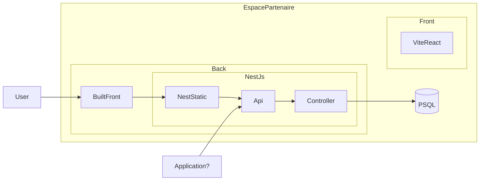

# Espace Partenaires

Espace Partenaires is a tool that makes it easy to integrate a MonComptePro button.

It allows you to manage access tokens, the name and description of the project, the URLs where the login button will appear and the authorization request.

## Requirements:

- docker et docker compose
- make
- node js / npm (pour le front)

## Installation

Install locally the application:

```
git clone git@github.com:betagouv/espace-partenaire.git
```

```sh
$ npm install
$ npm run dev # will do a docker compose up !
$ npm build
$ npm start
```

## Start backend

Launch backend

```
make sb
```

You can access the project here : http://localhost:3000/welcome

If you want to launch a the front served by the backend:

```
make f
```

You can see the static front on http://localhost:3000

## Start front end for dev

Launch the project with another node server locally (not on docker this time):

```
make sf
```

You can access it on http://localhost:3001/ :

## Global Architecture



There are two main subrepos in the EspacePartenaire project: back and front.

The frontend is built with Vite React. The build result is then moved to the backend repository and served with [Nest's serve static property](https://docs.nestjs.com/recipes/serve-static).

## How to build the project

Start front-end and back-end applications, then launch:

```
make f
```

Enjoy ! ✨

## Docker

```sh
# Run the local database and a local production app.
$ docker compose -f docker-compose.yaml -f docker-compose.app.yaml up
```
